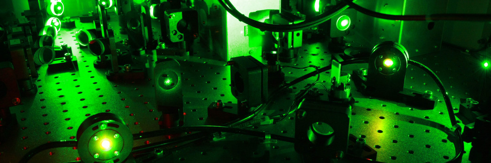

<!--  -->

## Namaskara! I am निशान्त मिश्रा @nishantaMishra 

- 🔭 I am a Physics Scholar.
- 🔎 Research Field - Nonlinear optics.
- 🌱 I am here to enhance my technical skills
- 👯 My mother language is the Hindi language.
- 🤝🏻 Looking for some open source project to collaborate with.
- 📫 The best way to contact me is via e-mai: nishunm2000@gmail.com

 

  

 

### My social media links :

 <!-- https://dev.to/envoy_/150-badges-for-github-pnk-->

<!---
nishantaMishra/nishantaMishra is a ✨ special ✨ repository because its `README.md` (this file) appears on your GitHub profile.
You can click the Preview link to take a look at your changes.
--->
