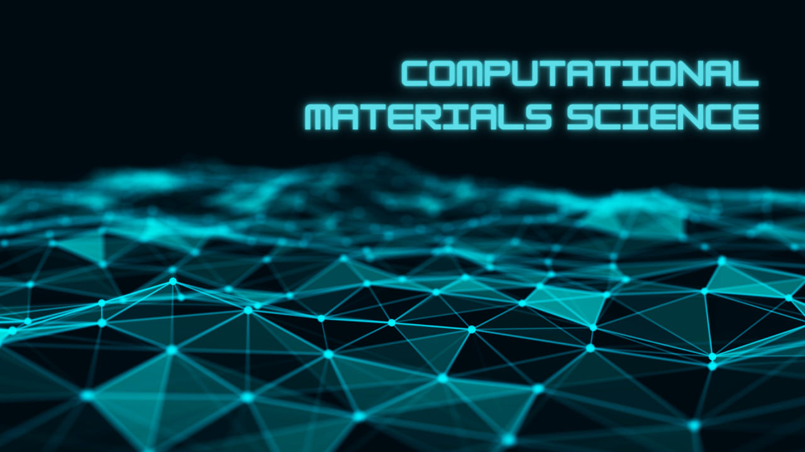

## Namaskara! I am निशान्त मिश्रा (Niśānta Miśrā) @nishantaMishra 

- 🔭 I am a Physics Scholar. Currently working at [Materials Modelling Laboratory](https://tanmoy-paul-tcg.github.io/) at TCG-CREST.
- 🌱 I am here to explore, store my codes and collaborate.
- 👯 My mother language is the Hindi language.
- 📫 The best way to contact me is via e-mai: nisantamisra00@gmail.com

 

  

 

 <!-- https://dev.to/envoy_/150-badges-for-github-pnk-->

<!---
nishantaMishra/nishantaMishra is a ✨ special ✨ repository.
--->
